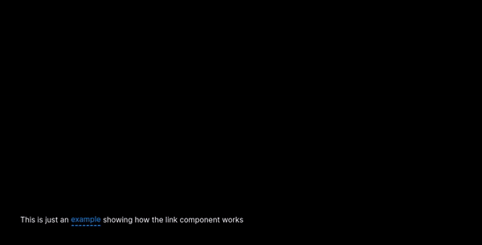

## What is neweb?

Neweb is the first fully-managed component library in the world!

But what does that mean?  
Well, it means our components interact with a backend to perform special logic  
that otherwise wouldn't be possible for a component library.

Take for example, our `Link` component:

It interacts with our backend in three different ways:

1. It asks for our servers to take a screenshot of the website the link is pointing to
2. It hits our safety endpoint where we call various services to determine the safety score of a website
3. It uses an AI model to create a summary of the website

## The "problem" with modern component libraries

Historically, component libraries have been limited by only existing on the frontend  
but we've discovered that by allowing our components to communicate with the backend,  
a whole new world of possibilities opens up!

## What's next?

We have dozens of ideas for components stashed in a file that we've yet to reveal,
but we're always looking for new innovative ideas, so if you have any, feel free to submit them
in a GitHub issue so we can discuss it.  
We also plan to fully support all major UI libraries, but we'll start with React since it's the most popular

## Our vision

We're really passionate about changing the way users interact with websites.  
We, together with the open-source community, want to create new patterns and  
make them so universal that they're as recognizable as the exit button in your browser!
